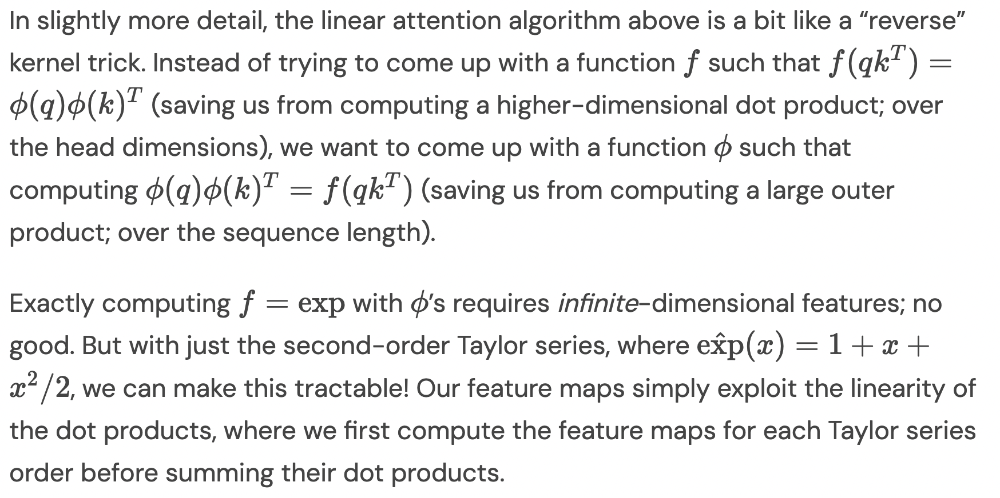

</img>

<small><a href="https://hazyresearch.stanford.edu/blog/2023-12-11-zoology2-based">blog post</a></small>

## Taylor Series Linear Attention

Explorations into the Taylor Series Linear Attention proposed in the paper <a href="https://arxiv.org/abs/2312.04927">Zoology: Measuring and Improving Recall in Efficient Language Models</a>

This repository will offer full self attention, cross attention, and autoregressive via CUDA kernel from `pytorch-fast-transformers`.

Be aware that in linear attention, the quadratic is pushed to the attention head dimension. With the second taylor expansion, this becomes O(D^3), so more research needed.

Update: It works! Strongest formulation of linear attention I've come across in the literature

## Appreciation

- <a href="https://a16z.com/supporting-the-open-source-ai-community/">A16Z Open Source AI Grant Program</a> and <a href="https://huggingface.co/">🤗 Huggingface</a> for the generous sponsorships, as well as my other sponsors, for affording me the independence to open source current artificial intelligence research

## Install

```bash
$ pip install taylor-series-linear-attention
```

## Usage

```python
import torch
from taylor_series_linear_attention import TaylorSeriesLinearAttn

attn = TaylorSeriesLinearAttn(
  dim = 512,
  dim_head = 16,
  heads = 16
)

x = torch.randn(1, 4096, 512)
mask = torch.ones((1, 4096)).bool()

out = attn(x, mask = mask)

assert x.shape == out.shape
```

Cross attention

```python
import torch
from taylor_series_linear_attention import TaylorSeriesLinearAttn

attn = TaylorSeriesLinearAttn(
  dim = 512,
  dim_head = 16,
  heads = 16
)

x = torch.randn(1, 1024, 512)

context = torch.randn(1, 65536, 512)
context_mask = torch.ones((1, 65536)).bool()

out = attn(x, context = context, mask = context_mask)

assert x.shape == out.shape
```

For autoregressive, first `pip install pytorch-fast-transformers`. Then set `causal = True`

```python
import torch
from taylor_series_linear_attention import TaylorSeriesLinearAttn

attn = TaylorSeriesLinearAttn(
  dim = 512,
  dim_head = 16,
  heads = 16,
  causal = True,        # set this to True
  rotary_emb = True     # rotary embeddings
)

x = torch.randn(1, 8192, 512)

out = attn(x)

assert x.shape == out.shape
```

## Todo

- [x] take care of caching for causal variant

## Citations

```bibtex
@inproceedings{Arora2023ZoologyMA,
  title   = {Zoology: Measuring and Improving Recall in Efficient Language Models},
  author  = {Simran Arora and Sabri Eyuboglu and Aman Timalsina and Isys Johnson and Michael Poli and James Zou and Atri Rudra and Christopher R'e},
  year    = {2023},
  url     = {https://api.semanticscholar.org/CorpusID:266149332}
}
```

```bibtex
@inproceedings{Keles2022OnTC,
  title   = {On The Computational Complexity of Self-Attention},
  author  = {Feyza Duman Keles and Pruthuvi Maheshakya Wijewardena and Chinmay Hegde},
  booktitle = {International Conference on Algorithmic Learning Theory},
  year    = {2022},
  url     = {https://api.semanticscholar.org/CorpusID:252198880}
}
```

```bibtex
@article{Shazeer2019FastTD,
  title   = {Fast Transformer Decoding: One Write-Head is All You Need},
  author  = {Noam M. Shazeer},
  journal = {ArXiv},
  year    = {2019},
  volume  = {abs/1911.02150}
}
```

```bibtex
@inproceedings{Peng2023RWKVRR,
  title   = {RWKV: Reinventing RNNs for the Transformer Era},
  author  = {Bo Peng and Eric Alcaide and Quentin G. Anthony and Alon Albalak and Samuel Arcadinho and Stella Biderman and Huanqi Cao and Xin Cheng and Michael Chung and Matteo Grella and G Kranthikiran and Xuming He and Haowen Hou and Przemyslaw Kazienko and Jan Kocoń and Jiaming Kong and Bartlomiej Koptyra and Hayden Lau and Krishna Sri Ipsit Mantri and Ferdinand Mom and Atsushi Saito and Xiangru Tang and Bolun Wang and Johan Sokrates Wind and Stansilaw Wozniak and Ruichong Zhang and Zhenyuan Zhang and Qihang Zhao and Peng Zhou and Jian Zhu and Rui Zhu},
  booktitle = {Conference on Empirical Methods in Natural Language Processing},
  year    = {2023},
  url     = {https://api.semanticscholar.org/CorpusID:258832459}
}
```

```bibtex
@inproceedings{Katharopoulos2020TransformersAR,
  title   = {Transformers are RNNs: Fast Autoregressive Transformers with Linear Attention},
  author  = {Angelos Katharopoulos and Apoorv Vyas and Nikolaos Pappas and Franccois Fleuret},
  booktitle = {International Conference on Machine Learning},
  year    = {2020},
  url     = {https://api.semanticscholar.org/CorpusID:220250819}
}
```

*The greatest shortcoming of the human race is man’s inability to understand the exponential function.* - Albert A. Bartlett
